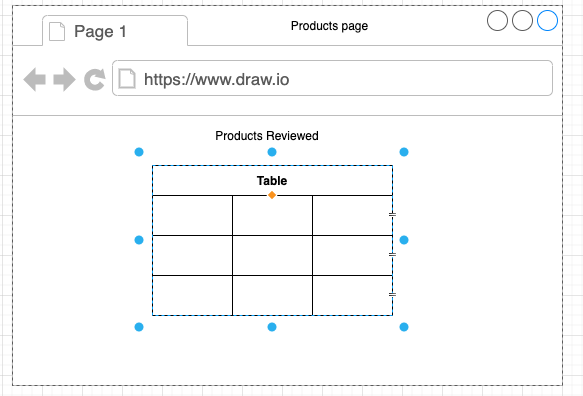
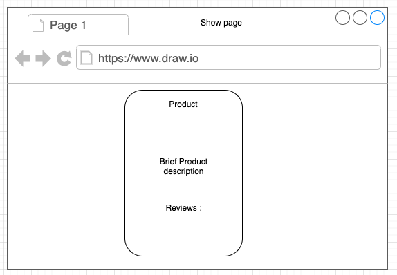
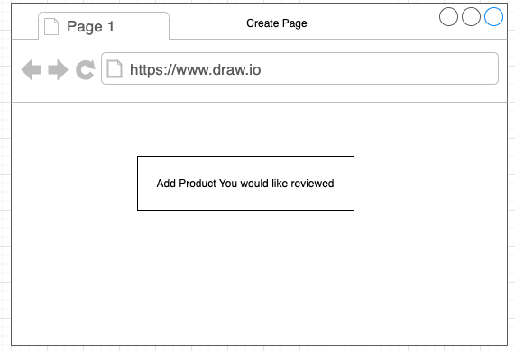

# The Curl Review
A web application where natural hair enthusiasts can form communities where they share their successess and failures with products marketed for curly/natural hair.

## Technologies Used
- HTML5
- CSS3
- Javascript
- jQuery
- Node.js
- Express.js
- Mongoose MongoDB
- Bootstrap
- Google Fonts

## Screenshots

### Home Page

### Index page

### Show page

### Create Page

## Getting Started
[Click Here]() to see the deployed app!

## Future Enchancments
- The addition of OAuth Authentication
